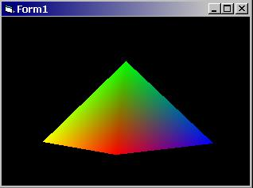



## DirectX8 Container Class\!

### Description

The purpose of this code is to supply would-be 3D graphic developers with a foundation class to ease the use of DirectX8, and for others to expand upon this code so that I can get past whatever learning block I'm currently experiencing. Presently, the only thing that actually 'happens' in the code is that the pyramid will spin if you drag the mouse over the form with the left mouse button down. Please vote for me, as this is my very first code submission (I've been saving for something cool, and I hope this is it!). As a side note, you must have DirectX8 installed on your computer for this to work.
 
### More Info
 
You MUST have DirectX8 installed on your machine (at LEAST the runtimes which are available at MicroShaft for free) for this code to even have a CHANCE at working!

I have only tested this code with Win2k/Win98, VB6, and DirectX8 with this code. If any systems/configurations are incompatible, please let me know. :)

             |
---                |---
**Submitted On**   |2001-07-19 17:01:32
**By**             |[Joseph T Hicks](https://github.com/Planet-Source-Code/PSCIndex/blob/master/ByAuthor/joseph-t-hicks.md)
**Level**          |Advanced
**User Rating**    |4.9 (69 globes from 14 users)
**Compatibility**  |VB 6\.0
**Category**       |[DirectX](https://github.com/Planet-Source-Code/PSCIndex/blob/master/ByCategory/directx__1-44.md)
**World**          |[Visual Basic](https://github.com/Planet-Source-Code/PSCIndex/blob/master/ByWorld/visual-basic.md)
**Archive File**   |[DirectX8 C231207192001\.zip](https://github.com/Planet-Source-Code/joseph-t-hicks-directx8-container-class__1-25238/archive/master.zip)

